# GitBasics
<h2> <b> 1.	Фінальні приготування </b> </h2>

1.1.	Встановлюємо ім'я та адресу електронної пошти для підпису зроблених вами змін.

 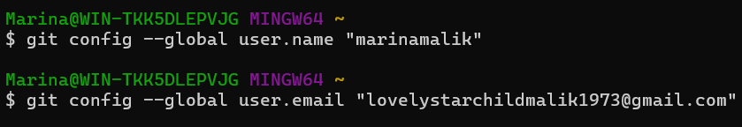 

1.2.	Налаштовуємо <b>main</b> як назву гілки за замовчуванням.

 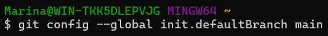 

1.3.	Щоб автоматично керувати закінченнями рядків і попереджати про можливі проблеми, але не блокувати виконання операцій, потрібно виконати команди (для користувачів Windows): <b>git config --global core.autocrlf true</b> та <b>git config --global core.safecrlf warn</b>.

 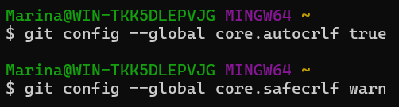 

<h2> <b> 2.	Створення проекту </b> </h2>

2.1.	Створюємо сторінку «Hello, World»:   
ㅤ•  Створюємо папку <b>work</b>, потім переходимо до неї та створюємо файл <b>hello.html</b>.   
Скріншот команди:

 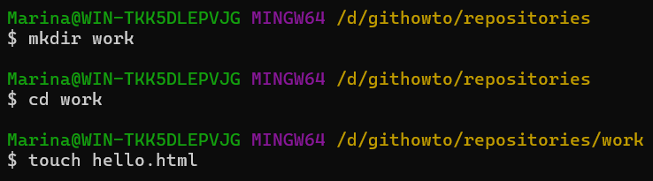 

Скріншот результату створення папки:

 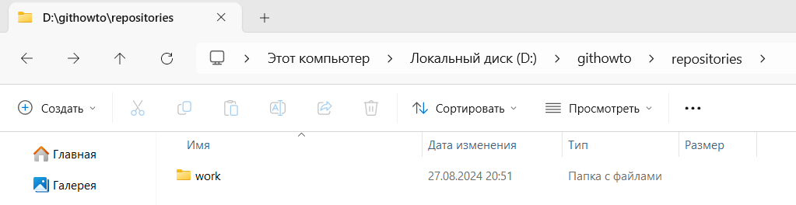 

Скріншот результату створення файлу:

 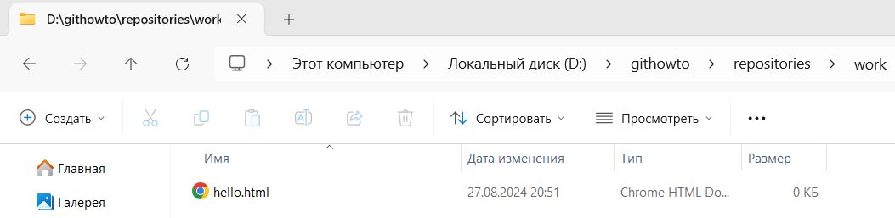 

ㅤ•  В створеному файлі додаємо зміст, зображений на скріншоті:

 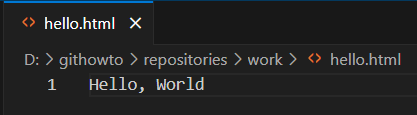 

2.2. Створюємо репозиторій за допомогою команди <b>git init</b>. 

 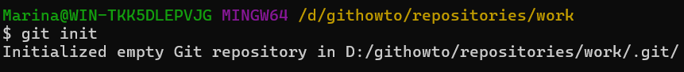 

2.3.	Додаємо сторінку у репозиторій.

 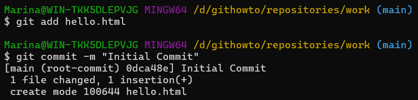 

<h2> <b> 3.	Перевірка стану </b> </h2>

3.1.	Перевіряємо поточний стан репозиторія, використовуючи команду <b>git status</b>.

 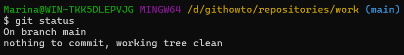 

<h2> <b> 4. Внесення змін </b> </h2>

4.1. Змінюємо вміст файлу <b>hello.html</b>, додаючи до вітання <b>HTML</b>-тег.

 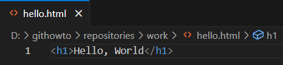 

4.2. Перевіряємо стан робочої директорії.

 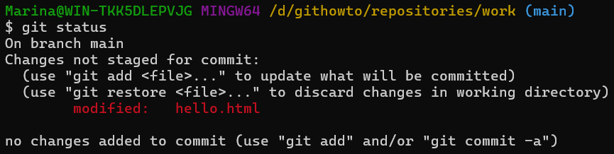 

<h2> <b> 5.	 Індексація змін </b> </h2>

5.1.	Проіндексуємо та перевіримо стан.

 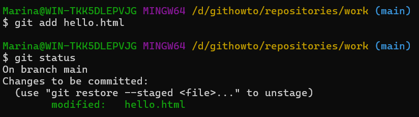 

<h2> <b> 7.	 Індексація та коміт </b> </h2>

7.1.	Закомітимо зміни:   
ㅤ•  Зробимо коміт, використавши команду <b>git commit</b>, після чого відкриється редактор з текстом, вписуємо в першому рядку коментар <b>Added h1 tag</b>, зберігаємо зміни.

 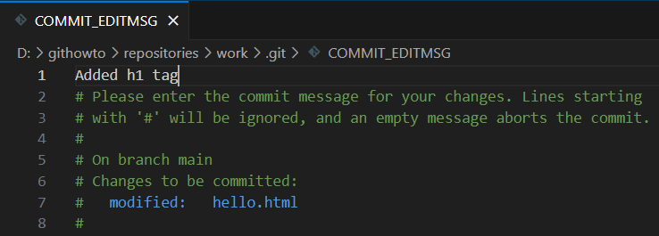 

ㅤ•  Виходимо з редактору. Після цього <b>Git</b> виведе повідомлення про успішний коміт.

 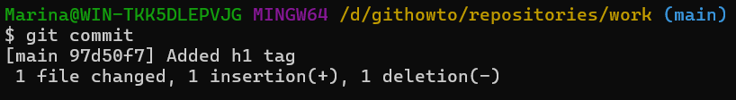 

7.2.	Перевіряємо стан. 

  

<h2> <b> 8. Зміни, а не файли </b> </h2>

8.1. Виконуємо першу зміну: додаємо стандартні теги сторінок <b>html</b> й <b>body</b> до файлу <b>hello.html</b>.

 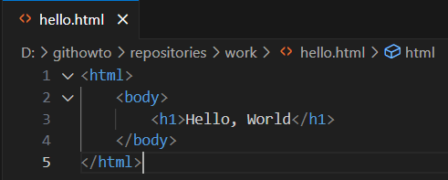 

8.2. Додаємо ці зміни, використовуючи команду <b>git add file</b>.

 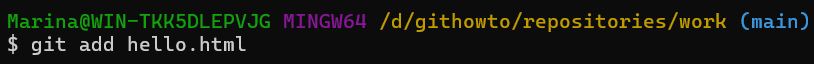 

8.3. Виконуємо другу зміну: додаємо заголовок <b>HTML</b> (секцію <b>head</b>) до файлу <b>hello.html</b>.

 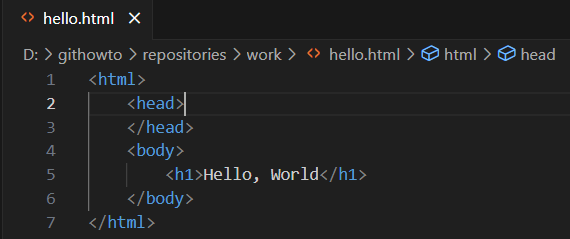 

8.4. Перевіряємо поточний статус.

  

8.5. Робимо коміт, а потім ще раз перевіряємо стан.

 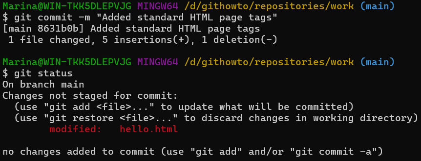 

8.6. Додаємо другу зміну та перевіряємо статус.

 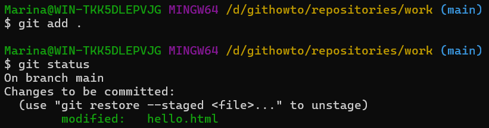 

8.7. Робимо коміт другої зміни.

 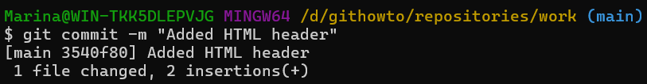 

<h2> <b> 9.	Історія проекту </b> </h2>

9.1.	Перегляд історії та однорядковий формат перегляду:   
ㅤ•  Для отримання списку зроблених змін використовуємо команду <b>git log</b>.

  

ㅤ•  Якщо додати до цієї команди <b>--pretty=oneline</b>, то можемо переглядати історію в один ряд. 

 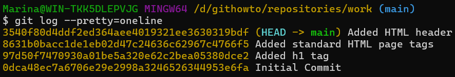 

9.2.	Існує величезна кількість варіантів перегляду історії. Наприклад, перегляд 2 останніх зроблених змін, усіх змін зроблені до чи після 5 хвилин тому, усіх змін зробленим певним автором або навіть вивести усю історію.

 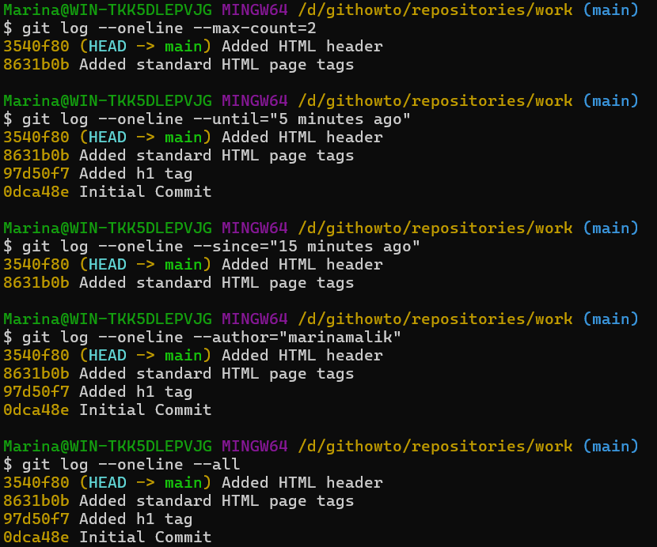 

9.3. Для перегляду змін, зроблених за останній тиждень, виконуємо команду, зображену в наведеному скріншоті, де <b>%h</b> — скорочений хеш коміту, <b>%ad</b> — дата коміту, <b>%s</b> — коментар, <b>%d</b> — доповнення коміту («голови» гілок та теги), <b>%an</b> — ім'я автора.

 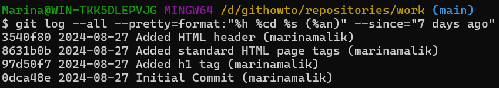 

9.4.	Кінцевий формат історії:   
ㅤ•  Для зручного перегляду історії комітів, виконуємо команду, зображену в наведеному скріншоті, де <b>--pretty="..."</b> — формат виходу, <b>%h</b> — скорочений хеш коміту, <b>%ad</b> — дата коміту, <b>|</b> — візуальний роздільник, <b>%s</b> — коментар, <b>%d</b> — доповнення коміту («голови» гілок та теги), <b>%an</b> — ім'я автора, <b>--date=short</b> — короткий формат дати.

 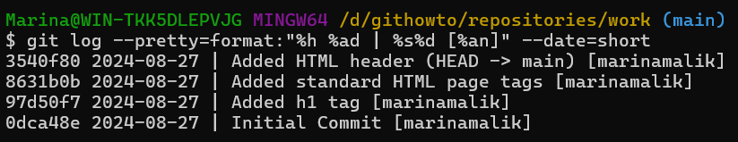 

ㅤ•  Налаштуємо кінцевий формат історії за замовчуванням.

 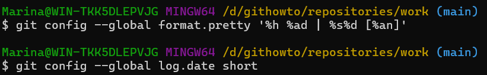 

<h2> <b> 10.	Отримання старих версій </b> </h2>

10.1.	Отримання хешів попередніх комітів:   
ㅤ•  Продивимося історію змін.

 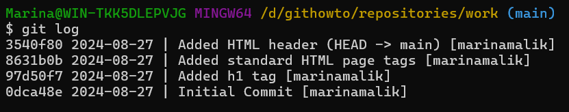 

ㅤ•  Повертаємо робочу директорію до першого коміту, використавши команду <b>checkout</b> та перевіряємо вміст файлу <b>hello.html</b>.

 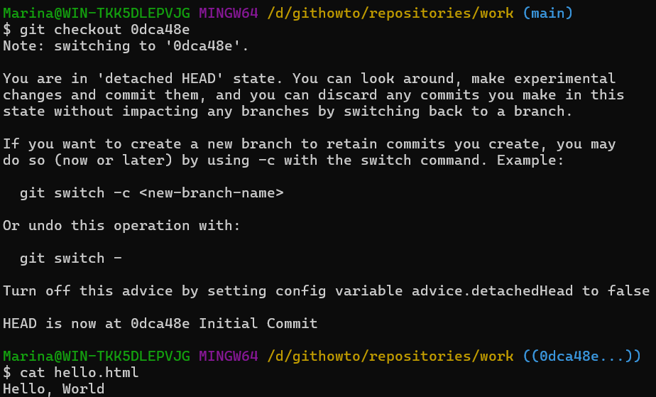 

10.2. Повертаємося до останньої версії в гілці <b>main</b> за допомогою команди <b>switch</b>.

  

<h2> <b> 11.	Створення тегів версій </b> </h2>

11.1.	Створюємо тег першої версії. [(Скріншот)](Screenshots/11.1.png)   
11.2.	Теги для попередніх версій:   
ㅤ•  Перемикаємося на коміт, попередній до `v1`. [(Скріншот)](Screenshots/11.2.а.png)   
ㅤ•  Для цієї версії створюємо тег `v1-beta`. [(Скріншот)](Screenshots/11.2.б.png)   
11.3.	Перемикаємося за іменами тегу. [(Скріншот)](Screenshots/11.3.png)   
11.4.	Переглянемо теги за допомогою команди `git tag`. [(Скріншот)](Screenshots/11.4.png)   
11.5.	Переглянемо теги у логах. [(Скріншот)](Screenshots/11.5.png)   

<h2> <b> 12.	Скасування локальних змін (до індексації) </b> </h2>

12.1.	Переходимо на гілку `main`. [(Скріншот)](Screenshots/12.1.png)   
12.2.	Змінюємо `hello.html`, додаючи небажаний коментар. [(Скріншот)](Screenshots/12.2.png)   
12.3.	Перевіряємо стан. [(Скріншот)](Screenshots/12.3.png)   
12.4.	Використовуємо `checkout` для скасування змін в робочій директорії, перемикаючись в версію файлу `hello.html` у репозиторії. [(Скріншот)](Screenshots/12.4.png)   

<h2> <b> 13.	Скасування проіндексованих змін (перед комітом) </b> </h2>

13.1.	Внесення змін у файл і їх індексація:   
ㅤ•  Вносимо зміни у файл `hello.html`, додаючи небажаний коментар. [(Скріншот)](Screenshots/13.1.а.png)   
ㅤ•  Проіндексуємо ці зміни. [(Скріншот)](Screenshots/13.1.б.png)   
13.2.	Перевіряємо стан. [(Скріншот)](Screenshots/13.2.png)   
13.3.	Скасуємо індексацію змін за допомогою команди `reset`. [(Скріншот)](Screenshots/13.3.png)   
13.4.	Переходимо на версію коміту. [(Скріншот)](Screenshots/13.4.png)   

<h2> <b> 14.	Скасування комітів </b> </h2>

14.1.	Зміна файлу та виконання коміту:   
ㅤ•  Змінимо файл `hello.html`, додаючи небажаний коментар. [(Скріншот)](Screenshots/14.1.а.png)    
ㅤ•  Виконуємо коміт. [(Скріншот)](Screenshots/14.1.б.png)   
14.2.	Виконуємо коміт з новими змінами, що скасовують попередні. [(Скріншот редактору](Screenshots/14.2.а.png) [та команди)](Screenshots/14.2.б.png)   
14.3.	Перевіряємо лог. [(Скріншот)](Screenshots/14.3.png)   

<h2> <b> 15.	Видалення комітів з гілки (revert) </b> </h2>

15.1.	Для початку позначимо останній коміт тегом. [(Скріншот)](Screenshots/15.1.png)   
15.2.	Використовуючи `reset`, відкатуємо до коміту, що передує до `oops`. Параметр `--hard` вказує, що робоча директорія повинна бути відновлена до того стану, що відповідає `HEAD`-коміту гілки. [(Скріншот)](Screenshots/15.2.png)   
15.3.	Переглянувши усі коміти, можемо побачити, що помилкові коміти не зникли. [(Скріншот)](Screenshots/15.3.png)   

<h2> <b> 16.	Видалення тегу oops </b> </h2>

16.1.	Видаляємо тег `oops`. [(Скріншот)](Screenshots/16.png)   

<h2> <b> 17.	Внесення змін до комітів </b> </h2>

17.1.	Зміна сторінки, а потім виконання коміту:   
ㅤ•  Додаємо в `hello.html` коментар автора. [(Скріншот)](Screenshots/17.1.а.png)   
ㅤ•  Виконуємо коміт. [(Скріншот)](Screenshots/17.1.б.png)   
17.2.	Додаємо в `hello.html` e-mail. [(Скріншот)](Screenshots/17.2.png)   
17.3.	Змінюємо попередній коміт. [(Скріншот)](Screenshots/17.3.png)   
17.4.	Переглянемо історію. [(Скріншот)](Screenshots/17.4.png)   

<h2> <b> 18.	Створення гілки </b> </h2>

18.1.	Створюємо гілку. [(Скріншот)](Screenshots/18.1.png)   
18.2.	Додавання файлу стилів `style.css`:   
ㅤ•  Створюємо файл `style.css`. [(Скріншот команди](Screenshots/18.2.а.png) [та результату створення файлу)](Screenshots/18.2.б.png)   
ㅤ•  В створеному файлі додаємо колір до `HTML`-тегу з текстом вітання нашого сайту. [(Скріншот)](Screenshots/18.2.в.png)   
ㅤ•  Виконуємо коміт. [(Скріншот)](Screenshots/18.2.г.png)   
18.3.	Зміна `hello.html` для того, щоб використовувати `style.css`:   
ㅤ•  В файлі `hello.html` додаємо посилання на `style.css` для стилізації сторінки. [(Скріншот)](Screenshots/18.3.а.png)   
ㅤ•  Виконуємо коміт. [(Скріншот)](Screenshots/18.3.б.png)   
  
<h2> <b> 19.	Перемикання гілок </b> </h2>

19.1.	Перемикання на гілку `main`:   
ㅤ•  Переглянемо історію усіх комітів. Можемо побачити, що тепер у нас є дві гілки. [(Скріншот)](Screenshots/19.1.а.png)   
ㅤ•  Перемикаємося між гілками, використовуючи `git switch` та переглядаємо вміст файлу `hello.html`. [(Скріншот)](Screenshots/19.1.б.png)   
19.2.	Повертаємося до гілки `style` та переглядаємо вміст файлу `hello.html`. [(Скріншот)](Screenshots/19.2.png)   
 	
<h2> <b> 20.	Переміщення файлів </b> </h2>

20.1.	Переглянемо історію змін файлу `hello.html`. [(Скріншот)](Screenshots/20.1.png)   
20.2.	Переглянемо різницю між версіями файлу `hello.html` за допомогою команди `show`. [(Скріншот)](Screenshots/20.2.png)   
20.3.	Перейменування `hello.html`:   
ㅤ•  Перейменуємо файл `hello.html`, використавши команду `mv`. [(Скріншот команди](Screenshots/20.3.а.png) [та результату)](Screenshots/20.3.б.png)   
ㅤ•  Додаємо зміну та перевіримо стан. [(Скріншот)](Screenshots/20.3.в.png)   
20.4.	Безпечне переміщення файлу `style.css`:   
ㅤ•  Створюємо папку `css`, безпечно переміщуємо за допомогою `git mv`, після чого ще раз перевіряємо стан. [(Скріншот команди,](Screenshots/20.4.a.png) [результату створення папки](Screenshots/20.4.б.png) [та переміщення файлу в цю папку)](Screenshots/20.4.в.png)   
ㅤ•  Закомітимо наші зміни і перевіримо історію змін у файлі `css/styles.css` та додаємо `--follow`, щоб побачити історію файлу до того, як він був переміщений. [(Скріншот)](Screenshots/20.4.г.png)   

<h2> <b> 21.	Зміни в гілці main </b> </h2>

21.1.	Створення файлу `README`:   
ㅤ•  Створимо файл `README`. [(Скріншот)](Screenshots/21.1.а.png)   
ㅤ•  В створеному файлі додаємо короткий опис до проекту. [(Скріншот)](Screenshots/21.1.б.png)   
21.2.	Закомітимо файл `README` у гілку `main`. [(Скріншот)](Screenshots/21.2.png)   

<h2> <b> 22.	Перегляд розбіжних гілок </b> </h2>

22.1.	Переглянемо поточні гілки у вигляді дерева, скориставшись `git log --all --graph`, де `--all` – побачити усі гілки,  `--graph` додає просте дерево комітів, зображене текстовими лініями. [(Скріншот)](Screenshots/22.png)   

<h2> <b> 23.	Злиття </b> </h2>

23.1.	Повернемося до гілки `style` і зіллємо `main` із `style`, потім переглянемо поточні гілки у вигляді дерева. [(Скріншот редактору](Screenshots/23.а.png) [та команд)](Screenshots/23.б.png)   

<h2> <b> 24.	Створення конфлікту </b> </h2>

24.1.	Повернення у `main` і створення конфлікту:   
ㅤ•  Повертаємося до гілки `main`. [(Скріншот)](Screenshots/24.1.а.png)   
ㅤ•  В файлі `hello.html` вносимо зміни, а саме дамо назву сайту та абзац. [(Скріншот)](Screenshots/24.1.б.png)    
ㅤ•  Виконуємо коміт. [(Скріншот)](Screenshots/24.1.в.png)   
24.2.	Переглянемо гілки. [(Скріншот)](Screenshots/24.2.png)   

<h2> <b> 25.	Вирішення конфліктів </b> </h2>

25.1.	Злиття `main` до гілки `style`:   
ㅤ•  Повертаємося до гілки `style` та зливаємо нещодавні зміни з гілки `main`. [(Скріншот)](Screenshots/25.1.а.png)   
ㅤ•  Подивимося статус. [(Скріншот)](Screenshots/25.1.б.png)   
ㅤ•  Відкривши `index.html`, то можна побачити те, що частина, що знаходиться в межах `<<<<<<< >>>>>>>` - є конфліктом. [(Скріншот)](Screenshots/25.1.в.png)   
25.2.	Скасуємо злиття, скориставшись командою `git merge --abort`. [(Скріншот)](Screenshots/25.2.png)   
25.3.	Рішення конфлікту:   
ㅤ•  Ще раз пробуємо злити нещодавні зміни з гілки `main`. [(Скріншот)](Screenshots/25.3.а.png)   
ㅤ•  Редагуємо файл до наступного стану, як показано на скріншоті. [(Скріншот)](Screenshots/25.3.б.png)   
25.4.	Зробимо коміт з розв'язаним конфліктом та подивимося на поточний стан. [(Скріншот)](Screenshots/25.4.png)   

<h2> <b> 27.	 Відкочування гілки style </b> </h2>

27.1.	Відкатуємо гілку `style` до останнього коміту перед злиттям, тобто за 2 коміти до `HEAD` за допомогою команди `reset`. [(Скріншот команд](Screenshots/27.1.а.png) [та результат відкату)](Screenshots/27.1.б.png)   
27.2.	Перевіряємо гілку. [(Скріншот)](Screenshots/27.2.png)   

<h2> <b> 28.	Перебазування </b> </h2>

28.1.	Перебазування гілки `style` на `main`:   
ㅤ•  Перенесемо зміни до гілки `style` за допомогою команди `rebase`. [(Скріншот)](Screenshots/28.1.а.png)   
ㅤ•  Конфлікт стався в файлі `hello.html`, а не в `index.html` через те, що `rebase` був у процесі застосування змін `style` поверх гілки `main`. У той момент в гілці `main` ще не було перейменовано файл `hello.html`, тому він все ще має стару назву. [(Скріншот)](Screenshots/28.1.б.png)   
28.2.	Розв'язування конфлікту:   
ㅤ•  Відредагуємо файл, щоб він відповідав скріншоту [(Скріншот)](Screenshots/28.2.а.png)   
ㅤ•  Додаємо усі зміни до індексу та продовжимо процес перебазування. [(Скріншот редактору](Screenshots/28.2.б.png) [та команд)](Screenshots/28.2.в.png)    (Скріншот редактору та команд)
ㅤ•  Подивимося на поточний стан та гілки. [(Скріншот)](Screenshots/28.2.г.png)   

<h2> <b> 29.	Злиття в гілку main </b> </h2>

29.1.	Зливаємо `style` в `main`. [(Скріншот)](Screenshots/29.1.png)   
29.2.	Переглянемо логи. [(Скріншот)](Screenshots/29.2.png)   

<h2> <b> 30.	Клонування репозиторіїв </b> </h2>

30.1.	Перейдемо в директорію `repositories`, глянемо поточну директорію, де зараз знаходимося та виведемо його вміст. [(Скріншот)](Screenshots/30.1.png)   
30.2.	Створюємо клон репозиторія `work` та виведемо вміст директорії. [(Скріншот команд](Screenshots/30.2.а.png) [та результату клонування)](Screenshots/30.2.б.png)    

<h2> <b> 31.	Перегляд клонованого репозиторія </b> </h2>

31.1.	Подивимося на клонований репозиторій. [(Скріншот)](Screenshots/31.1.png)   
31.2.	Переглянемо історію репозиторія. [(Скріншот)](Screenshots/31.2.png)   

<h2> <b> 32.	Що таке origin? </b> </h2>

32.1.	Що таке `origin`:   
ㅤ•  Виведемо список віддалених репозиторіїв, з якими пов'язаний наш репозиторій. На виході отримаємо ім'я за замовчуванням віддаленого репозиторія `origin`. [(Скріншот)](Screenshots/32.а.png)   
ㅤ•  Подивімось детальну інформацію про ім'я за замовчуванням. [(Скріншот)](Screenshots/32.б.png)   

<h2> <b> 33.	Віддалені гілки </b> </h2>

33.1.	Віддалені гілки:   
ㅤ•  Подивімось на гілки, доступні в нашому клонованому репозиторії за допомогою `git branch`. [(Скріншот)](Screenshots/33.а.png)   
ㅤ•  Щоб побачити всі гілки, до команди додаємо `-a`. [(Скріншот)](Screenshots/33.б.png)   

<h2> <b> 34.	Зміна оригінального репозиторія </b> </h2>

34.1.	Внесення змін в оригінальний репозиторій `work`:   
ㅤ•  У файл `README` в наступному рядку додаємо `(changed in origin)` [(Скріншот)](Screenshots/34.а.png)   
ㅤ•  Додаємо цю зміну і зробимо коміт. [(Скріншот)](Screenshots/34.б.png)   

<h2> <b> 35.	Підтягування змін </b> </h2>

35.1.	Підтягування змін:   
ㅤ•  Переходимо до репозиторію `home` та підтягуємо нові коміти з віддаленого репозиторія, використавши `git fetch`. [(Скріншот)](Screenshots/35.а.png)   
ㅤ•  Перевіряємо файл `README`. [(Скріншот)](Screenshots/35.б.png)   

<h2> <b> 36.	Злиття підтягнутих змін </b> </h2>

36.1.	Зливаємо підтягнуті зміни в локальну гілку `main`. [(Скріншот)](Screenshots/36.1.png)   
36.2.	Ще раз перевіряємо зміст файлу `README`. [(Скріншот)](Screenshots/36.2.png)   

<h2> <b> 37.	Додавання гілки відстеження </b> </h2>

37.1.	Додаємо локальну гілку, яка відстежує віддалену гілку. [(Скріншот)](Screenshots/37.png)   

<h2> <b> 38.	Чисті репозиторії </b> </h2>

38.1.	Перейдемо в директорію `repositories`, створюємо чистий репозиторій та виведемо його вміст. [(Скріншот команд](Screenshots/38.а.png) [та результату створення чистого репозиторію)](Screenshots/38.б.png)    

<h2> <b> 39.	Додавання віддаленого репозиторія </b> </h2>

39.1.	Додаємо репозиторій `work.git` до нашого оригінального репозиторія. [(Скріншот)](Screenshots/39.png)   

<h2> <b> 40.	Відправка змін </b> </h2>

40.1.	Відправка змін:   
ㅤ•  В файлі `README` змінюємо другий рядок на `(changed in the origin and pushed to shared)`. [(Скріншот)](Screenshots/40.а.png)   
ㅤ•  Робимо коміт змін. [(Скріншот)](Screenshots/40.б.png)   
ㅤ•  Надсилаємо зміни до спільного репозиторія. [(Скріншот)](Screenshots/40.в.png)   

<h2> <b> 41.	Підтягування спільних змін </b> </h2>

41.1.	Підтягування спільних змін:   
ㅤ•  Перемикаємось в репозиторій `home`. [(Скріншот)](Screenshots/41.а.png)   
ㅤ•  Підтягуємо зміни, щойно відправлені в спільний репозиторій. [(Скріншот)](Screenshots/41.б.png)   

<h2> <b> 42.	Розміщення ваших Git репозиторіїв </b> </h2>

42.1.	Запуск `Git`-сервера:   
ㅤ•  За допомогою `git daemon` запускаємо `Git`-сервер. [(Скріншот)](Screenshots/42.а.png)   
ㅤ•  Тепер в окремому вікні термінала переходимо до директорії `repositories`, клонуємо репозиторій `work.git` у нову папку `network_work` через локальний `Git`-сервер. [(Скріншот)](Screenshots/42.б.png)   

