# GitBasics
<h2> <b> 1.	Фінальні приготування </b> </h2>

1.1.	Встановлюємо ім'я та адресу електронної пошти для підпису зроблених вами змін.

  

1.2.	Налаштовуємо <b>main</b> як назву гілки за замовчуванням.

  

1.3.	Щоб автоматично керувати закінченнями рядків і попереджати про можливі проблеми, але не блокувати виконання операцій, потрібно виконати команди (для користувачів Windows): <b>git config --global core.autocrlf true</b> та <b>git config --global core.safecrlf warn</b>.

  

<h2> <b> 2.	Створення проекту </b> </h2>

2.1.	Створюємо сторінку «Hello, World»:   
ㅤ•  Створюємо папку <b>work</b>, потім переходимо до неї та створюємо файл <b>hello.html</b>.   
Скріншот команди:

  

Скріншот результату створення папки:

  

Скріншот результату створення файлу:

  

ㅤ•  В створеному файлі додаємо зміст, зображений на скріншоті:

  

2.2. Створюємо репозиторій за допомогою команди <b>git init</b>. 

  

2.3.	Додаємо сторінку у репозиторій.

  

<h2> <b> 3.	Перевірка стану </b> </h2>

3.1.	Перевіряємо поточний стан репозиторія, використовуючи команду <b>git status</b>.

  

<h2> <b> 4. Внесення змін </b> </h2>

4.1. Змінюємо вміст файлу <b>hello.html</b>, додаючи до вітання <b>HTML</b>-тег.

  

4.2. Перевіряємо стан робочої директорії.

  

<h2> <b> 5.	 Індексація змін </b> </h2>

5.1.	Проіндексуємо та перевіримо стан.

  

<h2> <b> 7.	 Індексація та коміт </b> </h2>

7.1.	Закомітимо зміни:   
ㅤ•  Зробимо коміт, використавши команду <b>git commit</b>, після чого відкриється редактор з текстом, вписуємо в першому рядку коментар <b>Added h1 tag</b>, зберігаємо зміни.

  

ㅤ•  Виходимо з редактору. Після цього <b>Git</b> виведе повідомлення про успішний коміт.

  

7.2.	Перевіряємо стан. 

 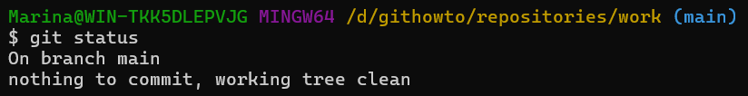 

<h2> <b> 8. Зміни, а не файли </b> </h2>

8.1. Виконуємо першу зміну: додаємо стандартні теги сторінок <b>html</b> й <b>body</b> до файлу <b>hello.html</b>.

  

8.2. Додаємо ці зміни, використовуючи команду <b>git add file</b>.

  

8.3. Виконуємо другу зміну: додаємо заголовок <b>HTML</b> (секцію <b>head</b>) до файлу <b>hello.html</b>.

  

8.4. Перевіряємо поточний статус.

 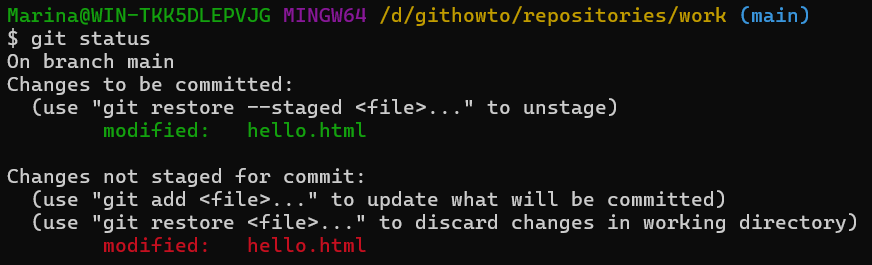 

8.5. Робимо коміт, а потім ще раз перевіряємо стан.

  

8.6. Додаємо другу зміну та перевіряємо статус.

  

8.7. Робимо коміт другої зміни.

  

<h2> <b> 9.	Історія проекту </b> </h2>

9.1.	Перегляд історії та однорядковий формат перегляду:   
ㅤ•  Для отримання списку зроблених змін використовуємо команду <b>git log</b>.

  

ㅤ•  Якщо додати до цієї команди <b>--pretty=oneline</b>, то можемо переглядати історію в один ряд. 

  

9.2.	Існує величезна кількість варіантів перегляду історії. Наприклад, перегляд 2 останніх зроблених змін, усіх змін зроблені до чи після 5 хвилин тому, усіх змін зробленим певним автором або навіть вивести усю історію.

  

9.3. Для перегляду змін, зроблених за останній тиждень, виконуємо команду, зображену в наведеному скріншоті, де <b>%h</b> — скорочений хеш коміту, <b>%ad</b> — дата коміту, <b>%s</b> — коментар, <b>%d</b> — доповнення коміту («голови» гілок та теги), <b>%an</b> — ім'я автора.

  

9.4.	Кінцевий формат історії:   
ㅤ•  Для зручного перегляду історії комітів, виконуємо команду, зображену в наведеному скріншоті, де <b>--pretty="..."</b> — формат виходу, <b>%h</b> — скорочений хеш коміту, <b>%ad</b> — дата коміту, <b>|</b> — візуальний роздільник, <b>%s</b> — коментар, <b>%d</b> — доповнення коміту («голови» гілок та теги), <b>%an</b> — ім'я автора, <b>--date=short</b> — короткий формат дати.

  

ㅤ•  Налаштуємо кінцевий формат історії за замовчуванням.

  

<h2> <b> 10.	Отримання старих версій </b> </h2>

10.1.	Отримання хешів попередніх комітів:   
ㅤ•  Продивимося історію змін.

  

ㅤ•  Повертаємо робочу директорію до першого коміту, використавши команду <b>checkout</b> та перевіряємо вміст файлу <b>hello.html</b>.

  

10.2. Повертаємося до останньої версії в гілці <b>main</b> за допомогою команди <b>switch</b>.

 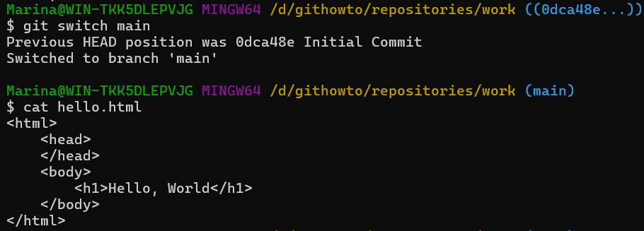 

<h2> <b> 11.	Створення тегів версій </b> </h2>

11.1.	Створюємо тег першої версії.

 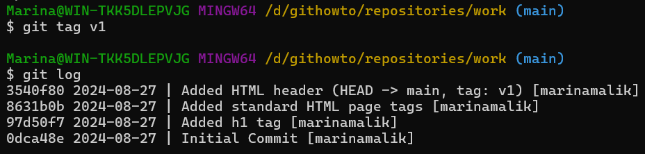 

11.2.	Теги для попередніх версій:   
ㅤ•  Перемикаємося на коміт, попередній до <b>v1</b>.

  

ㅤ•  Для цієї версії створюємо тег <b>v1-beta</b>.

  

11.3.	Перемикаємося за іменами тегу.

 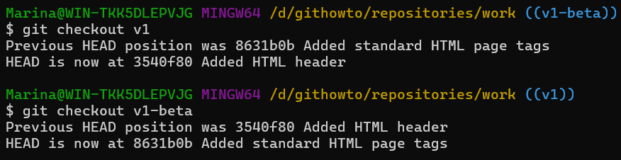 

11.4. Переглянемо теги за допомогою команди <b>git tag</b>. 

 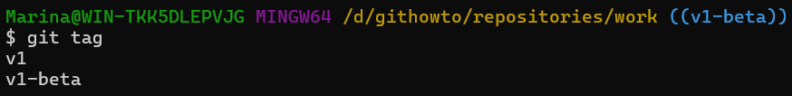 

11.5. Переглянемо теги у логах.

 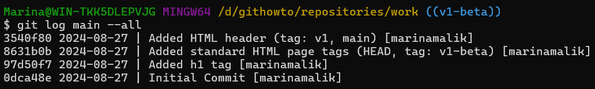 

<h2> <b> 12. Скасування локальних змін (до індексації) </b> </h2>

12.1. Переходимо на гілку <b>main</b>.

 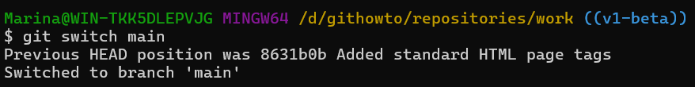 

12.2. Змінюємо <b>hello.html</b>, додаючи небажаний коментар.

 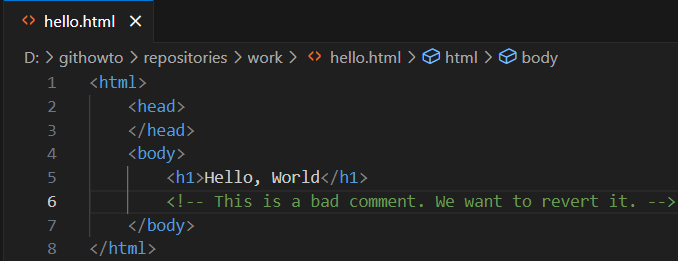 

12.3. Перевіряємо стан.

 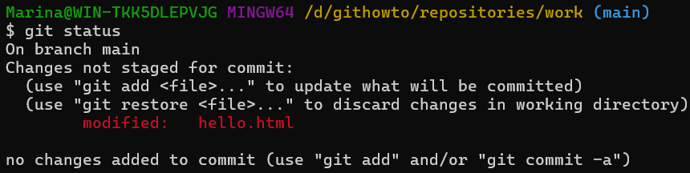 

12.4. Використовуємо <b>checkout</b> для скасування змін в робочій директорії, перемикаючись в версію файлу <b>hello.html</b> у репозиторії.

 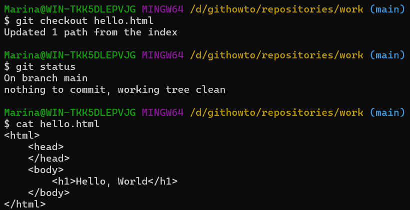 

<h2> <b> 13.	Скасування проіндексованих змін (перед комітом) </b> </h2>

13.1.	Внесення змін у файл і їх індексація:   
ㅤ•  Вносимо зміни у файл <b>hello.html</b>, додаючи небажаний коментар.

  

ㅤ•  Проіндексуємо ці зміни.

  

13.2. Перевіряємо стан.

  

13.3. Скасуємо індексацію змін за допомогою команди <b>reset</b>.

 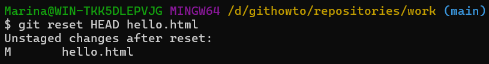 

13.4. Переходимо на версію коміту.

  

<h2> <b> 14.	Скасування комітів </b> </h2>

14.1.	Зміна файлу та виконання коміту:   
ㅤ•  Змінимо файл <b>hello.html</b>, додаючи небажаний коментар.

  

ㅤ•  Виконуємо коміт.

  

14.2.	Виконуємо коміт з новими змінами, що скасовують попередні.
Скріншот команди:

  

Скріншот редактору:

  
  
14.3. Перевіряємо лог.

 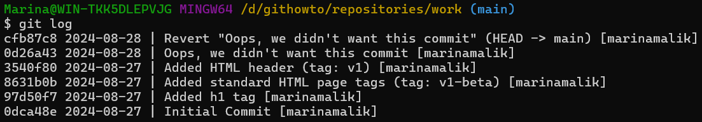 

<h2> <b> 15.	Видалення комітів з гілки (revert) </b> </h2>

15.1. Для початку позначимо останній коміт тегом.

 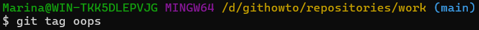 

15.2. Використовуючи <b>reset</b>, відкатуємо до коміту, що передує до <b>oops</b>. Параметр <b>--hard</b> вказує, що робоча директорія повинна бути відновлена до того стану, що відповідає <b>HEAD</b>-коміту гілки.

  

15.3. Переглянувши усі коміти, можемо побачити, що помилкові коміти не зникли.

 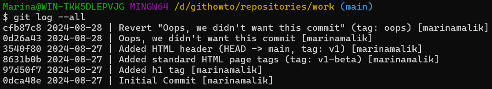 

<h2> <b> 16.	Видалення тегу oops </b> </h2>

16.1. Видаляємо тег <b>oops</b>.  

 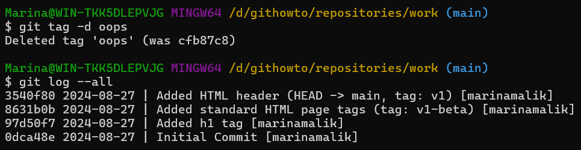 
  

<h2> <b> 17.	Внесення змін до комітів </b> </h2>

17.1.	Зміна сторінки, а потім виконання коміту:   
ㅤ•  Додаємо в <b>hello.html</b> коментар автора.

  

ㅤ•  Виконуємо коміт.

  

17.2. Додаємо в <b>hello.html</b> e-mail.

 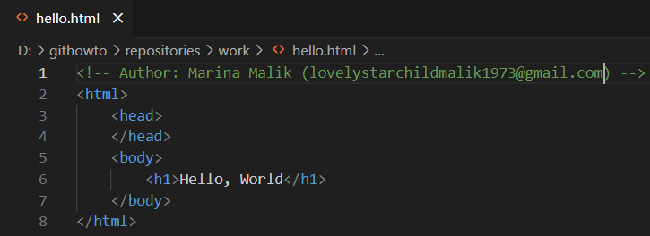 

17.3. Змінюємо попередній коміт.

 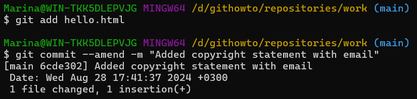 

17.4. Переглянемо історію.

 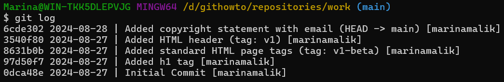 

<h2> <b> 18.	Створення гілки </b> </h2>

18.1.	Створюємо гілку.

 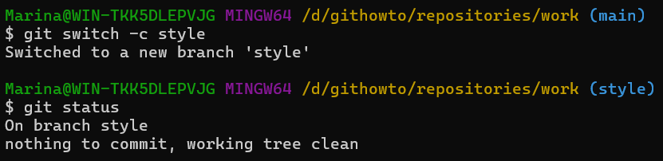 

18.2.	Додавання файлу стилів <b>style.css</b>:   
ㅤ•  Створюємо файл <b>style.css</b>.   
Скріншот команди:

  

Скріншот результату створення файлу:

  
 
ㅤ•  В створеному файлі додаємо колір до <b>HTML</b>-тегу з текстом вітання нашого сайту.

  

ㅤ•  Виконуємо коміт.

  

18.3.	Зміна <b>hello.html</b> для того, щоб використовувати <b>style.css</b>:   
ㅤ•  В файлі <b>hello.html</b> додаємо посилання на <b>style.css</b> для стилізації сторінки.

  

ㅤ•  Виконуємо коміт.

  

  
<h2> <b> 19.	Перемикання гілок </b> </h2>

19.1.	Перемикання на гілку <b>main</b>:   
ㅤ•  Переглянемо історію усіх комітів. Можемо побачити, що тепер у нас є дві гілки.

  

ㅤ•  Перемикаємося між гілками, використовуючи <b>git switch</b> та переглядаємо вміст файлу <b>hello.html</b>.

  

19.2. Повертаємося до гілки <b>style</b> та переглядаємо вміст файлу <b>hello.html</b>.

 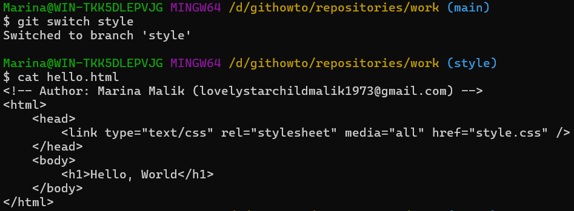 

 	
<h2> <b> 20.	Переміщення файлів </b> </h2>

20.1. Переглянемо історію змін файлу <b>hello.html</b>.

 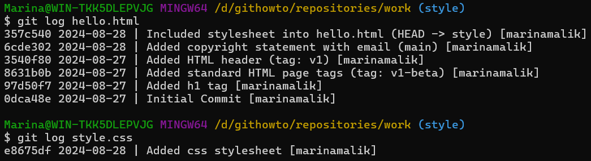 

20.2. Переглянемо різницю між версіями файлу <b>hello.html</b> за допомогою команди <b>show</b>.

 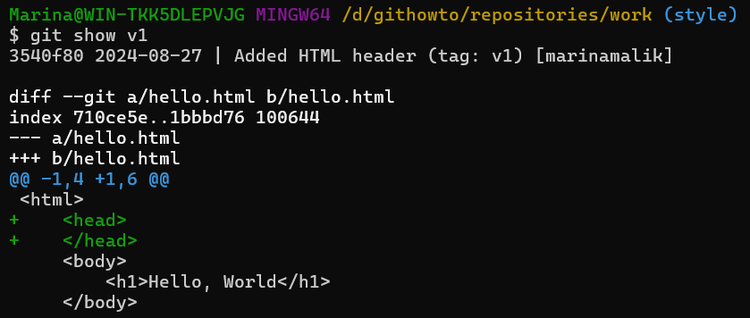 

20.3.	Перейменування <b>hello.html</b>:   
ㅤ•  Перейменуємо файл <b>hello.html</b>, використавши команду <b>mv</b>.   
Скріншот команди:

  

Скріншот результату:

  

ㅤ•  Додаємо зміну та перевіримо стан.

  

20.4.	Безпечне переміщення файлу <b>style.css</b>:   
ㅤ•  Створюємо папку <b>css</b>, безпечно переміщуємо за допомогою <b>git mv</b>, після чого ще раз перевіряємо стан.   
Скріншот команди:

 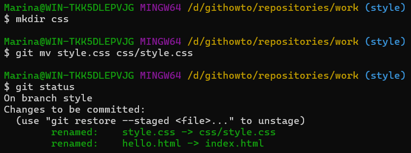 

Скріншот результату створення папки:

  

Скріншот результату переміщення файлу в папку <b>css</b>:
 

ㅤ•  Закомітимо наші зміни і перевіримо історію змін у файлі <b>css/styles.css</b> та додаємо <b>--follow</b>, щоб побачити історію файлу до того, як він був переміщений.

  

<h2> <b> 21.	Зміни в гілці main </b> </h2>

21.1.	Створення файлу <b>README</b>:   
ㅤ•  Створимо файл <b>README</b>.

  

ㅤ•  В створеному файлі додаємо короткий опис до проекту.

  

21.2.	Закомітимо файл <b>README</b> у гілку <b>main</b>.

 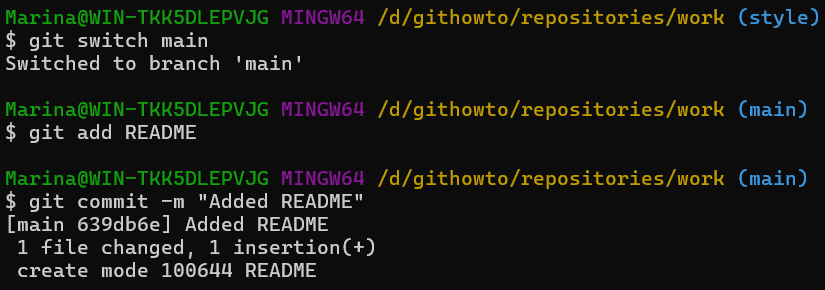 

<h2> <b> 22.	Перегляд розбіжних гілок </b> </h2>

22.1. Переглянемо поточні гілки у вигляді дерева, скориставшись <b>git log --all --graph</b>, де <b>--all</b> – побачити усі гілки, <b>--graph</b> додає просте дерево комітів, зображене текстовими лініями. 

 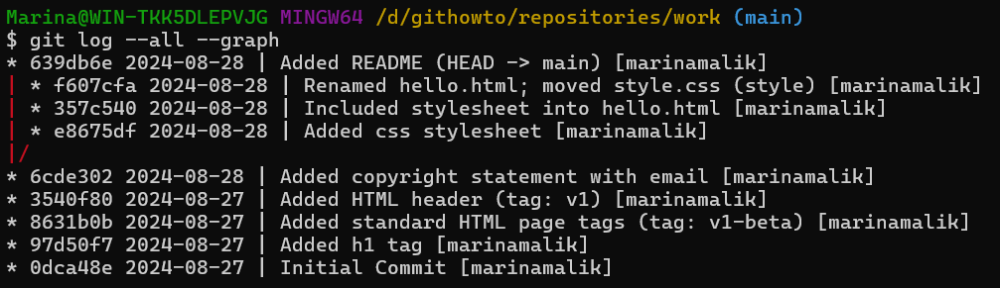 

<h2> <b> 23.	Злиття </b> </h2>

23.1.	Повернемося до гілки <b>style</b> і зіллємо <b>main</b> із <b>style</b>, потім переглянемо поточні гілки у вигляді дерева.   
Скріншот редактору:

  

Скріншот команд:

  

<h2> <b> 24.	Створення конфлікту </b> </h2>

24.1.	Повернення у <b>main</b> і створення конфлікту:   
ㅤ•  Повертаємося до гілки <b>main</b>.

  

ㅤ•  В файлі <b>hello.html</b> вносимо зміни, а саме дамо назву сайту та абзац.

  

ㅤ•  Виконуємо коміт.

  

24.2. Переглянемо гілки.

 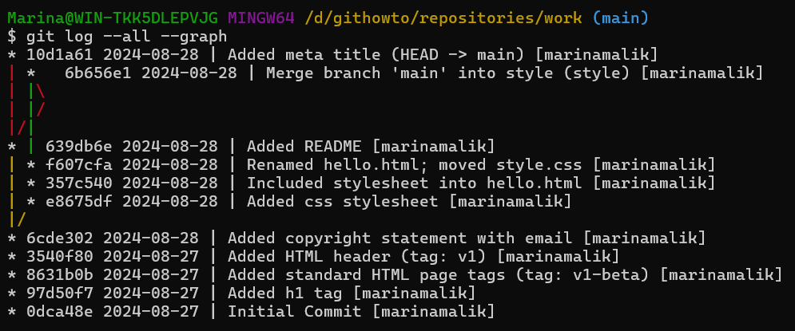 

<h2> <b> 25.	Вирішення конфліктів </b> </h2>

25.1.	Злиття <b>main</b> до гілки <b>style</b>:   
ㅤ•  Повертаємося до гілки <b>style</b> та зливаємо нещодавні зміни з гілки <b>main</b>.

  

ㅤ•  Подивимося статус.

  

ㅤ•  Відкривши <b>index.html</b>, то можна побачити те, що частина, що знаходиться в межах <b><<<<<<< >>>>>>></b> - є конфліктом.
 

25.2.	Скасуємо злиття, скориставшись командою <b>git merge --abort</b>.

 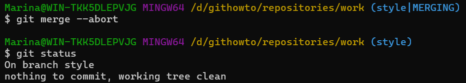 

25.3.	Рішення конфлікту:   
ㅤ•  Ще раз пробуємо злити нещодавні зміни з гілки <b>main</b>.

  

ㅤ•  Редагуємо файл до наступного стану, як показано на скріншоті.

  

25.4. Зробимо коміт з розв'язаним конфліктом та подивимося на поточний стан.

 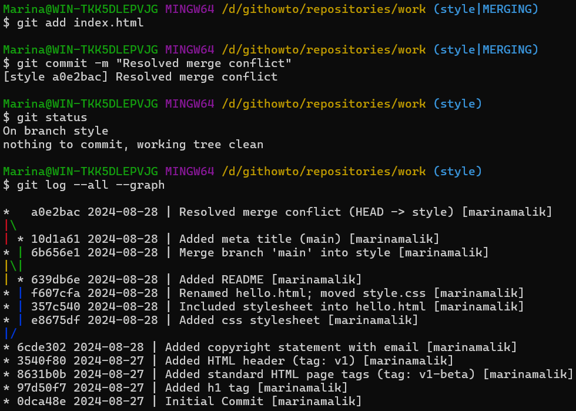 

<h2> <b> 27.	 Відкочування гілки style </b> </h2>

27.1. Відкатуємо гілку <b>style</b> до останнього коміту перед злиттям, тобто за 2 коміти до <b>HEAD</b> за допомогою команди <b>reset</b>.   
Скріншот команд:

  

Скріншот резульату відкату:

  

27.2. Перевіряємо гілку. 

 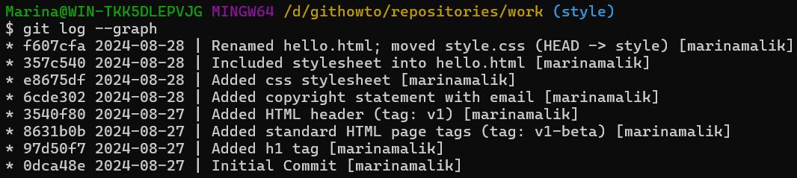 

<h2> <b> 28.	Перебазування </b> </h2>

28.1.	Перебазування гілки <b>style</b> на <b>main</b>:   
ㅤ•  Перенесемо зміни до гілки <b>style</b> за допомогою команди <b>rebase</b>.

  

ㅤ•  Конфлікт стався в файлі <b>hello.html</b>, а не в <b>index.html</b> через те, що <b>rebase</b> був у процесі застосування змін <b>style</b> поверх гілки <b>main</b>. У той момент в гілці <b>main</b> ще не було перейменовано файл <b>hello.html</b>, тому він все ще має стару назву.
 

28.2.	Розв'язування конфлікту:   
ㅤ•  Відредагуємо файл, щоб він відповідав скріншоту.

  

ㅤ•  Додаємо усі зміни до індексу та продовжимо процес перебазування.   
Скріншот редактору:

  

Скріншот команд:

  

ㅤ•  Подивимося на поточний стан та гілки.

  

<h2> <b> 29.	Злиття в гілку main </b> </h2>

29.1. Зливаємо <b>style</b> в <b>main</b>.

 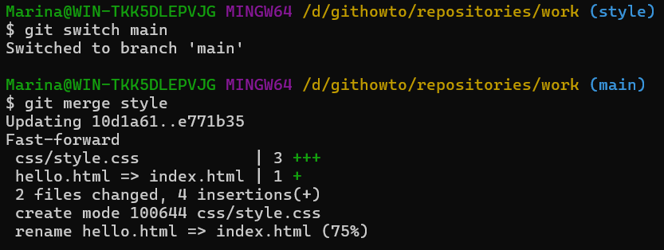 

29.2. Переглянемо логи.

 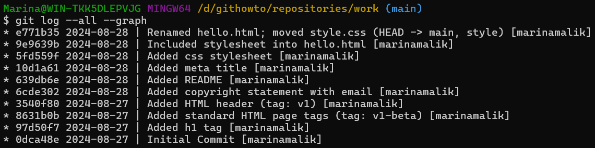 

<h2> <b> 30.	Клонування репозиторіїв </b> </h2>

30.1. Перейдемо в директорію <b>repositories</b>, глянемо поточну директорію, де зараз знаходимося, та виведемо його вміст.

  

30.2. Створюємо клон репозиторія <b>work</b> та виведемо вміст директорії.    
Скріншот команд:

  
 
Скріншот результату клонування:

  

<h2> <b> 31.	Перегляд клонованого репозиторія </b> </h2>

31.1. Подивимося на клонований репозиторій.

 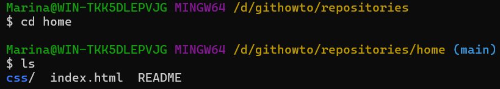 

31.2. Переглянемо історію репозиторія.

 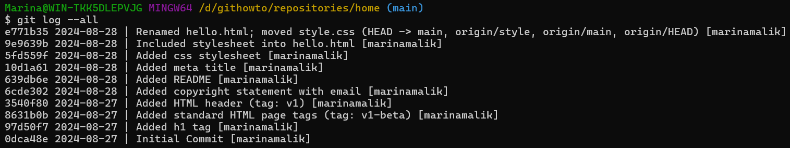 

<h2> <b> 32.	Що таке origin? </b> </h2>

32.1.	Що таке <b>origin</b>:   
ㅤ•  Виведемо список віддалених репозиторіїв, з якими пов'язаний наш репозиторій. На виході отримаємо ім'я за замовчуванням віддаленого репозиторія <b>origin</b>.

  

ㅤ•  Подивімось детальну інформацію про ім'я за замовчуванням.

  

<h2> <b> 33.	Віддалені гілки </b> </h2>

33.1.	Віддалені гілки:   
ㅤ•  Подивімось на гілки, доступні в нашому клонованому репозиторії за допомогою <b>git branch</b>.

  

ㅤ•  Щоб побачити всі гілки, до команди додаємо <b>-a</b>.

  

<h2> <b> 34.	Зміна оригінального репозиторія </b> </h2>

34.1.	Внесення змін в оригінальний репозиторій <b>work</b>:   
ㅤ•  У файл <b>README</b> в наступному рядку додаємо <b>(changed in origin)</b>.

  

ㅤ•  Додаємо цю зміну і зробимо коміт.

  

<h2> <b> 35.	Підтягування змін </b> </h2>

35.1.	Підтягування змін:   
ㅤ•  Переходимо до репозиторію <b>home</b> та підтягуємо нові коміти з віддаленого репозиторія, використавши <b>git fetch</b>.

  

ㅤ•  Перевіряємо файл <b>README</b>.

  

<h2> <b> 36.	Злиття підтягнутих змін </b> </h2>

36.1.	Зливаємо підтягнуті зміни в локальну гілку `main`. [(Скріншот)](Screenshots/36.1.png)   
36.2.	Ще раз перевіряємо зміст файлу `README`. [(Скріншот)](Screenshots/36.2.png)   

<h2> <b> 37.	Додавання гілки відстеження </b> </h2>

37.1.	Додаємо локальну гілку, яка відстежує віддалену гілку. [(Скріншот)](Screenshots/37.png)   

<h2> <b> 38.	Чисті репозиторії </b> </h2>

38.1.	Перейдемо в директорію `repositories`, створюємо чистий репозиторій та виведемо його вміст. [(Скріншот команд](Screenshots/38.а.png) [та результату створення чистого репозиторію)](Screenshots/38.б.png)    

<h2> <b> 39.	Додавання віддаленого репозиторія </b> </h2>

39.1.	Додаємо репозиторій `work.git` до нашого оригінального репозиторія. [(Скріншот)](Screenshots/39.png)   

<h2> <b> 40.	Відправка змін </b> </h2>

40.1.	Відправка змін:   
ㅤ•  В файлі `README` змінюємо другий рядок на `(changed in the origin and pushed to shared)`. [(Скріншот)](Screenshots/40.а.png)   
ㅤ•  Робимо коміт змін. [(Скріншот)](Screenshots/40.б.png)   
ㅤ•  Надсилаємо зміни до спільного репозиторія. [(Скріншот)](Screenshots/40.в.png)   

<h2> <b> 41.	Підтягування спільних змін </b> </h2>

41.1.	Підтягування спільних змін:   
ㅤ•  Перемикаємось в репозиторій `home`. [(Скріншот)](Screenshots/41.а.png)   
ㅤ•  Підтягуємо зміни, щойно відправлені в спільний репозиторій. [(Скріншот)](Screenshots/41.б.png)   

<h2> <b> 42.	Розміщення ваших Git репозиторіїв </b> </h2>

42.1.	Запуск `Git`-сервера:   
ㅤ•  За допомогою `git daemon` запускаємо `Git`-сервер. [(Скріншот)](Screenshots/42.а.png)   
ㅤ•  Тепер в окремому вікні термінала переходимо до директорії `repositories`, клонуємо репозиторій `work.git` у нову папку `network_work` через локальний `Git`-сервер. [(Скріншот)](Screenshots/42.б.png)   

